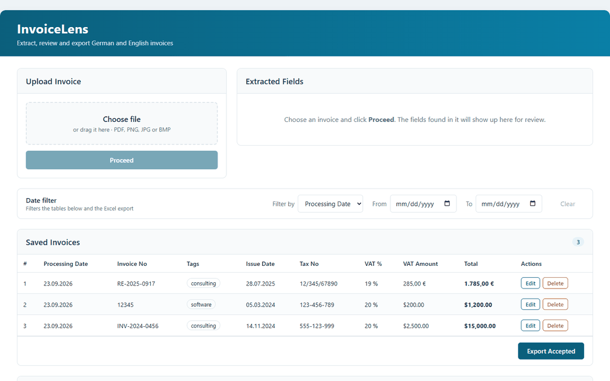
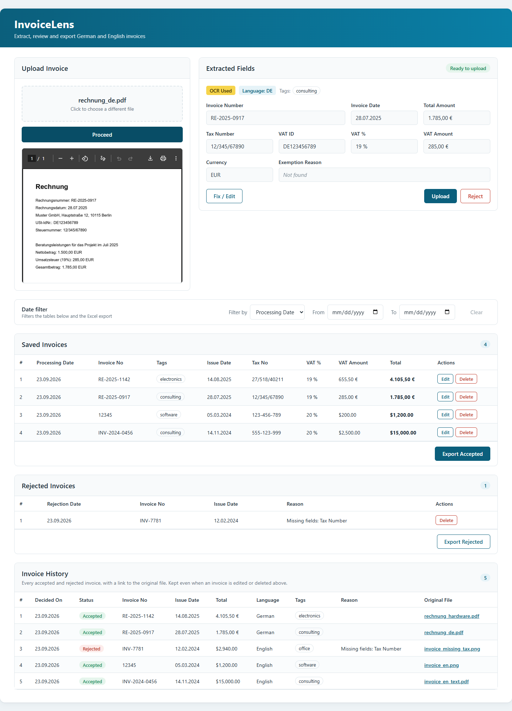

# InvoiceLens

**OCR invoice extraction for German and English invoices.**

Upload an invoice (PDF, scan or photo), check the fields InvoiceLens reads from it, then save or reject it. Saved invoices can be filtered by date and exported to Excel for accounting.



## What it does

- Reads the text layer of digital PDFs with pdfplumber. If there isn't one (a scanned PDF or a photo), it runs Tesseract OCR instead.
- Extracts invoice number, invoice date, total, VAT amount, VAT rate, VAT ID, tax number and exemption reason, using rule-based patterns for German and English.
- Detects the invoice language and reads amounts in the right format: `1.785,00` on a German invoice and `1,785.00` on an English one are both stored as `1785.00`.
- Detects the currency from the symbols and codes on the invoice (€, EUR, $, USD, £, GBP, CHF). German invoices with no marker default to EUR. Amounts are shown the way the invoice wrote them, so `1.785,00 €` and `$1,200.00`.
- Flags missing mandatory fields. You can fix them in the form, and the invoice becomes ready to upload as soon as they are filled in.
- Blocks duplicates across saved and rejected invoices.
- Saved invoices can be edited and deleted, and rejected ones deleted, from the tables.
- Keeps an invoice history: every accepted or rejected invoice is recorded with its fields, tags, reason and a link to the original file. Editing or deleting an invoice later does not change its history row.
- Tags each invoice with a category by matching English and German keywords in its text: consulting, software, electronics, travel, food, office, telecom and vehicle (or uncategorized). Tags are saved with the invoice, shown in the tables, and can be corrected with Edit.
- One date filter (by processing date or issue date) narrows the Saved, Rejected and History tables and the Excel export. Either end of the range can be left open.
- Exports saved or rejected invoices to Excel. Amounts are real number cells, so they can be summed, with currency and tags in their own columns.

## Tech stack

| Layer | Technology |
|-------|-----------|
| Backend API | Python, FastAPI |
| Text extraction | pdfplumber, Tesseract OCR (pytesseract, pdf2image) |
| Language detection | langdetect |
| Database | SQLite |
| Export | openpyxl |
| Frontend | React, axios, react-toastify |
| Tests | pytest (backend), Jest and React Testing Library (frontend) |

## Run locally

### Prerequisites

- Python 3.10 or newer
- Node.js 18 or newer
- [Tesseract OCR](https://github.com/tesseract-ocr/tesseract), for scanned invoices
- [Poppler](https://poppler.freedesktop.org/), which pdf2image uses to turn scanned PDFs into images. On Windows, download a [release](https://github.com/oschwartz10612/poppler-windows/releases) and add its `Library/bin` folder to your PATH.

### Backend

```bash
git clone https://github.com/zainab-yekta/InvoiceLens.git
cd InvoiceLens/backend
python -m venv env
source env/bin/activate        # Windows: env\Scripts\activate
pip install -r requirements.txt
uvicorn main:app --reload
```

The API runs on http://127.0.0.1:8000, and interactive docs are at http://127.0.0.1:8000/docs. The SQLite database (`invoices.db`) is created next to `main.py` on first start, and uploaded invoice files are kept in `backend/uploads/`. Both are git-ignored.

### Frontend

```bash
cd frontend
npm install
npm start
```

The app opens on http://localhost:3000. To use a different backend address, set `REACT_APP_API_URL` before `npm start`.

### Tests

```bash
cd backend
pytest

cd frontend
npm test -- --watchAll=false
```

Backend tests cover amount, date and currency parsing in both formats, tagging (including look-alike words that must not match), field extraction from sample German and English invoices, and every API endpoint against a throwaway database. Frontend tests cover number and date formatting, the date filter, tags, editing and deleting, the history file links, and fixing a rejected invoice before upload.

## API endpoints

| Method | Endpoint | Description |
|--------|----------|-------------|
| POST | `/extract_fields` | Upload a PDF or image and get the extracted fields back |
| POST | `/save_invoice` | Save a reviewed invoice |
| POST | `/reject_invoice` | Store a rejected invoice with its reason |
| GET | `/get_invoices` | List saved invoices, rejected invoices and the invoice history |
| PUT | `/update_invoice/{id}` | Edit fields of a saved invoice |
| DELETE | `/delete_invoice/{id}` | Delete a saved invoice |
| DELETE | `/delete_rejected/{id}` | Delete a rejected invoice |
| GET | `/files/{history_id}` | Open the original file of a history entry |
| POST | `/export_excel` | Download saved or rejected invoices as .xlsx, optionally for a date range |

## Screenshot



## Project structure

```
InvoiceLens/
├── backend/
│   ├── main.py            # FastAPI app and routes
│   ├── parser.py          # Field extraction, amount/date/currency parsing, tags
│   ├── pdf_utils.py       # pdfplumber text extraction with OCR fallback
│   ├── database.py        # SQLite access and Excel export
│   ├── check_schema.py    # Prints the table columns, for debugging
│   ├── requirements.txt
│   ├── uploads/           # Original invoice files (created at runtime, git-ignored)
│   └── tests/             # test_parser.py, test_api.py
├── frontend/
│   └── src/
│       ├── App.js         # State and API calls
│       ├── format.js      # Number, currency and date helpers
│       ├── *.test.js      # Frontend tests
│       └── components/    # UploadCard, ExtractedFields, InvoiceTable, EditInvoiceModal
└── mockups/
    ├── preview.gif        # Walkthrough used at the top of this README
    └── dashboard.png
```

## Design decisions

- **Text first, OCR second.** pdfplumber is fast and exact on digital PDFs. OCR only runs when a PDF has almost no text, or when the upload is an image.
- **Amount format comes from the number.** Whichever of `.` or `,` comes last is the decimal separator. The detected language only decides the truly ambiguous case, like `1.234`.
- **One list of mandatory fields.** The backend defines it once and sends it with every extraction result, so the frontend and backend always agree.
- **Column names are allow-listed.** User input never ends up in SQL as a column name.
- **The history is append-only.** The Saved and Rejected tables are working lists you can edit and clean up. The history table is never edited or deleted, so it stays a reliable record of what was decided and why.
- **Tags come from keywords, not guesses.** Each keyword must start a word, so "Reisekosten" counts as travel but "Preise" doesn't. Words that also appear in addresses and footers are guarded: "Essen" (a city), "Bahnhofstraße", "Registered office".
- **Stored files can't be reached by path.** Uploads get a random name, and the file link goes through the history ID, so a request can't point at other files on the server.

## Limitations

- Extraction is rule-based. Invoice layouts the patterns don't cover will come back with missing fields for manual review.
- Tagging reads the whole invoice text, including the seller's name and address, and only knows the keywords in `TAG_KEYWORDS` in `parser.py`. An item it has no keyword for gets "uncategorized".
- Dates with slashes are read day-first (`05/03/2024` is 5 March), which suits EU invoices.
- `$` is read as US dollars. For other dollar currencies, correct the Currency field before saving.
- A file is stored as soon as you click Proceed. Files for invoices that are never saved or rejected stay in `backend/uploads/`.
- No user accounts. It's meant to run locally.

## Author

Built by **Zeinab Ramezani Yekta**, Full-Stack Developer
[LinkedIn](https://linkedin.com/in/zeinab-ramezani) · [GitHub](https://github.com/zainab-yekta)
